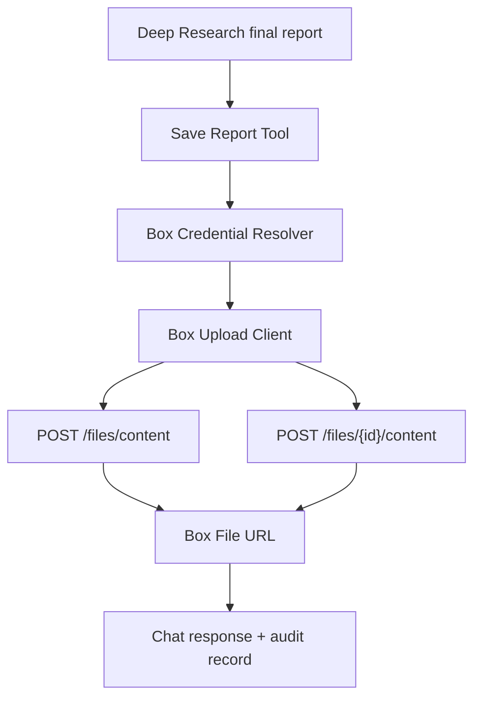

# Box Export Design

調査日: 2026-06-15  
目的: Deep Researchで生成されたレポートをBoxへ保存する方法を比較し、推奨案を決める。

## 結論

推奨は `Tool実装`。  
理由は、Deep Researchのレポート生成後に明示的な「保存」アクションとして呼びやすく、Connectorの責務を壊さないため。

短期:

- `save_report_to_box` Tool
- MarkdownまたはDOCXをBoxへupload
- 保存先folder IDをユーザーまたは管理者設定から取得

中期:

- Workflow化
- テンプレート、命名規則、metadata付与、既存ファイルversion更新

長期:

- 独立Export Service
- DLP、承認、監査、再試行、キュー処理を分離

## 候補比較

| 候補 | 概要 | 長所 | 短所 | 評価 |
|---|---|---|---|---|
| Connector拡張 | Box Connectorに保存機能も持たせる | Credential再利用が容易 | Connectorはingest責務。egressを混ぜると保守性低下 | 非推奨 |
| Tool実装 | LLM/Deep Researchから保存Toolを呼ぶ | OnyxのTool設計に合う。明示アクションにしやすい | UI/権限/保存先設計が必要 | 推奨 |
| Workflow実装 | レポート生成後の自動処理として保存 | 定型業務に強い | 初期実装が重い。失敗時UXが難しい | Phase 2 |
| 独立サービス | Export専用API/worker | 監査・再試行・DLPに強い | 運用コンポーネント増 | Phase 3 |

## Box API適合性

Box保存に必要なAPI:

- folder作成
  - `POST /folders`
- 新規file upload
  - `POST /files/content`
- 既存fileのversion更新
  - `POST /files/{file_id}/content`
- file更新
  - `PUT /files/{file_id}`
- file metadata
  - `GET /files/{file_id}/metadata`
  - metadata instance create/update系

Box公式では、50MB超はchunk upload推奨。Deep Researchレポートは通常50MB未満のため、direct uploadで十分。

## 推奨Tool設計

### Tool名

```text
save_report_to_box
```

### 入力

```json
{
  "folder_id": "123456789",
  "file_name": "market-research-2026-06-15.md",
  "content": "...",
  "format": "markdown",
  "overwrite_strategy": "new_version",
  "metadata": {
    "source": "onyx_deep_research",
    "chat_session_id": "...",
    "created_by": "...",
    "source_count": "12"
  }
}
```

### 出力

```json
{
  "file_id": "987654321",
  "web_url": "https://app.box.com/file/987654321",
  "version_id": "123",
  "status": "uploaded"
}
```

## 保存形式

### Markdown

推奨初期形式。

長所:

- 実装が軽い
- citationを保持しやすい
- diff/version管理しやすい

短所:

- クライアント向け資料としては見栄え調整が必要

### DOCX

推奨中期形式。

長所:

- クライアント向け資料に向く
- Box previewとの相性が良い

短所:

- 生成・検証コストが上がる

### PDF

長期または配布用。

長所:

- 固定レイアウト
- 外部共有に向く

短所:

- 編集しにくい
- 生成パイプラインが重い

推奨:

- Phase 1: Markdown
- Phase 2: DOCX
- Phase 3: PDF export optional

## 保存先設計

### Option A: ユーザーがfolder IDを指定

- PoC向け。
- UIが軽い。
- 誤保存リスクあり。

### Option B: 管理者が既定folderを設定

- 組織運用向け。
- 保存先権限を統制しやすい。
- 部門別保存先の設計が必要。

### Option C: プロジェクト/Document Setごとに保存先を紐付け

- 本番向け。
- Deep Researchの検索範囲と保存先を一致させやすい。
- 管理UIが必要。

推奨:

- Phase 1: A + B
- Phase 2: C

## overwrite strategy

候補:

- `always_new`
  - 毎回新規ファイル
- `new_version`
  - 同名ファイルがあればversion更新
- `fail_if_exists`
  - 同名ファイルがあれば失敗

推奨:

- 初期値は `always_new`
- 定期レポートでは `new_version`

## 権限と監査

保存時に確認すべきこと:

- 実行ユーザーが保存先folderへupload可能か。
- 保存先folderの共有範囲が、参照元文書の共有範囲より広すぎないか。
- レポートに機密sourceが含まれていないか。
- Box file metadataに以下を保存するか。
  - Onyx chat session ID
  - source document IDs
  - generated by
  - generated at
  - model/provider

初期実装:

- upload成功/失敗をOnyx側に保存。
- 権限差分は警告。

本番実装:

- 権限差分が危険な場合は保存ブロック。
- 監査ログへ保存。
- 管理者ポリシーで外部共有folderを禁止。

## Connector拡張を非推奨にする理由

Connectorはingestion担当。

- 外部データ取得
- Document生成
- checkpoint
- permission sync

Box保存はegress。

- ユーザー操作
- レポート生成物
- 書き込み権限
- 保存先選択
- 監査

責務が異なるため、Connectorにupload機能を混ぜると設計が曖昧になる。

## 推奨アーキテクチャ



## 実装時の最小要件

- CCG Credentialを再利用またはExport専用Credentialを作成。
- Box upload API client。
- Markdown file生成。
- folder ID指定。
- success/failure表示。
- file URL返却。

## 参照

- Box upload new file: https://developer.box.com/reference/post-files-content
- Box upload file version: https://developer.box.com/reference/post-files-id-content
- Box create folder: https://developer.box.com/reference/post-folders
- Box update file: https://developer.box.com/reference/put-files-id

