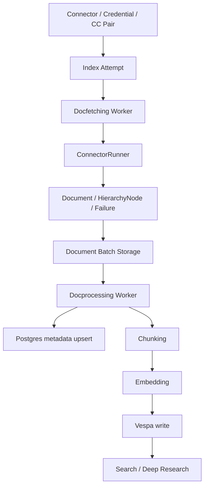

# Onyx Connector Architecture

調査日: 2026-06-15  
対象: Onyx `44b7a5c`（2026-06-14）

## 要約

- Box Connector追加は、Onyxの既存Connector拡張方式に適合する。
- 実装の中心は `backend/onyx/connectors/box/connector.py` と、権限同期を行う場合の `backend/ee/onyx/external_permissions/box/`。
- Boxを企業コンテンツ層として扱うなら、単純なDropbox型ではなく、Google Drive / SharePoint型の「階層 + 権限 + 増分同期」実装が必要。
- 権限同期まで含める場合はEnterprise Edition側の実装に依存する。

## 主要構成

OnyxのConnectorは、データ取得のみを担う。検索・チャンク化・埋め込み・Vespa投入は共通パイプラインが担当する。

## Connectorの実装方式

主要インターフェース:

- `BaseConnector`
  - `load_credentials()`
  - `validate_connector_settings()`
  - `normalize_url()`
  - `set_raw_file_callback()`
- `LoadConnector`
  - 全件ロード向け。`load_from_state()`
- `PollConnector`
  - 時間窓での同期向け。`poll_source(start, end)`
- `CheckpointedConnector`
  - 中断再開・大規模Connector向け。`load_from_checkpoint(start, end, checkpoint)`
- `CheckpointedConnectorWithPermSync`
  - 初回取り込み時に権限も取得するConnector向け。
- `SlimConnector / SlimConnectorWithPermSync`
  - 権限同期や差分検出用に軽量な文書ID・権限情報を返す。
- `CredentialsConnector`
  - 実行中にCredential更新が必要なConnector向け。Slackが該当。
- `Resolver`
  - 失敗文書の再取得向け。
- `HierarchyConnector`
  - 階層ノード取得向け。

Boxでは以下が現実的。

- MVP: `CheckpointedConnector`
- 権限同期込み: `CheckpointedConnectorWithPermSync` + `SlimConnectorWithPermSync`
- 失敗再処理: `Resolver`
- フォルダ階層保持: `HierarchyNode`を通常のcheckpoint出力に含める

## Connectorの登録

登録に必要な箇所:

- `DocumentSource` enum
- `CONNECTOR_CLASS_MAP`
- フロントエンドのConnector一覧・設定フォーム
- 必要ならOAuth / Credentialフォーム
- EE権限同期の `_SOURCE_TO_SYNC_CONFIG`

現時点のOnyxには `DocumentSource.BOX` は存在しない。

## ライフサイクル

1. 管理者がConnector設定を作成
2. Credentialを作成
3. ConnectorとCredentialを `ConnectorCredentialPair` として紐付け
4. `validate_ccpair_for_user()` が設定・Credential・権限同期可否を検証
5. refresh frequencyに従ってIndex Attemptが作成
6. `run_docfetching_entrypoint()` がConnectorをinstantiate
7. `ConnectorRunner` がConnector出力をbatch化
8. batchをfile storeへ保存
9. docprocessing taskをCeleryへ投入
10. docprocessingでPostgres/Vespaへ反映
11. 成功時にcheckpoint・最終同期時刻を更新
12. 権限同期が有効なら、別Celery jobでdoc/group syncを実行

## 認証方式

Onyx内部の基本形:

- CredentialはDBの `credential.credential_json` に暗号化保存。
- Connectorの `load_credentials()` がCredentialを解釈。
- token refresh等でCredential更新が必要な場合は更新後のdictを返す。
- 実行中更新が必要なConnectorは `CredentialsConnector` と `OnyxDBCredentialsProvider` を使う。

既存例:

- Google Drive
  - OAuth / Service Account
  - Google Workspace admin権限を使う場合あり
- SharePoint
  - MSAL confidential client
  - client secretまたはcertificate
- Slack
  - Bot token
  - Redis retry handler + credential provider
- Dropbox
  - static access token

Box候補:

- 推奨: Client Credentials Grant（CCG）
- 企業全体検索: `box_subject_type=enterprise`
- ユーザー代理が必要な場合: `box_subject_type=user` + 管理者/Managed User ID

## ドキュメント取り込みフロー

Connectorが返す最小単位は `Document`。

主な項目:

- `id`
- `sections`
- `source`
- `semantic_identifier`
- `metadata`
- `doc_updated_at`
- `primary_owners`
- `external_access`
- `parent_hierarchy_raw_node_id`
- `file_id`

ファイル系Connectorでは、次の流れが標準。

1. 外部APIでファイル一覧を取得
2. 対象拡張子・サイズ・更新日時でフィルタ
3. ファイル本文をダウンロード
4. `extract_file_text()` / `extract_text_and_images()` で本文抽出
5. `TextSection` / `ImageSection` / `TabularSection` を作成
6. `Document` と `HierarchyNode` をyield

BoxではBox APIのfolder traversalまたはSearch APIで一覧化し、`GET /files/{id}/content` で本文取得する設計が自然。

## インデックス作成フロー

Docprocessing側の共通処理:

1. 空文書・巨大文書をフィルタ
2. PostgresへDocument metadataをupsert
3. 既存文書との比較
   - `doc_updated_at` が古ければskip
   - content hashが同じならskip
4. 画像があればvision LLMで要約
5. chunkerでチャンク化
6. contextual RAGが有効なら文書/チャンク要約を付与
7. embedderでembedding生成
8. Vespaへwrite
9. 成功文書のcontent hashを更新

Connector側は「取り込むべきDocumentを正しく返す」ことに集中できる。

## 権限制御の仕組み

Onyxの権限制御は3段階。

### 1. Connector単位

`ConnectorCredentialPair.access_type`:

- `PUBLIC`
  - 全ユーザー閲覧可
- `PRIVATE`
  - 作成者や明示許可ユーザー/グループのみ
- `SYNC`
  - 外部システムのACLを同期

### 2. Document単位

`ExternalAccess`:

- `external_user_emails`
- `external_user_group_ids`
- `is_public`

これが検索時のACLフィルタに変換される。

### 3. 外部グループ同期

EE側の `external_permissions` が、外部グループIDをOnyxユーザーemail群へ解決する。

Boxで権限同期をやる場合:

- ファイル/フォルダcollaborationを `ExternalAccess` に変換
- Box groupを `ExternalUserGroup` に変換
- フォルダ継承権限はGoogle Drive同様、folder IDを外部groupとして扱う設計が有効

## 増分同期の仕組み

Onyx共通:

- 前回成功時刻から今回時刻までの時間窓を作る。
- `POLL_CONNECTOR_OFFSET` 分だけ開始時刻を戻して取りこぼしを減らす。
- `IndexAttempt` に `poll_range_start/end` を保存。
- checkpointは「docfetchingがどのbatchまで作ったか」を保存。
- 失敗・キャンセル時はcheckpointから再開可能。

Connector固有:

- Google Drive
  - 独自checkpointで処理stage、取得済みfolder/file IDを保持。
- SharePoint
  - Microsoft Graph delta APIを使い、delta page URLをcheckpointに保持。
- Slack
  - channel list、channelごとのtimestamp、seen threadをcheckpointに保持。
- Dropbox
  - `client_modified` を時間窓で見る簡易poll。checkpointなし。

Box候補:

- MVP
  - `modified_at` による時間窓 + checkpoint。
- 強化版
  - Box Events APIの `stream_position` をcheckpointに保持。
  - enterprise eventsはlong polling不可のため、定期poll前提。

## Box Connector追加の実現性

実現性: 高い。

理由:

- Onyx側にファイル系Connectorの共通パターンが十分ある。
- Box APIは認証、folder traversal、download、metadata、comments、collaboration、versions、eventsを提供。
- Google Drive / SharePointの設計を流用しやすい。

主な難所:

- enterprise全体をどの主体で見に行くか。
- Box権限の継承・共有リンク・外部ユーザー・グループをOnyx ACLへどう落とすか。
- Events APIの保持期間・重複・削除/移動イベント処理。
- 大規模テナントでのAPI rate limitとcheckpoint粒度。

## 参照

- Onyx source: `backend/onyx/connectors/interfaces.py`
- Onyx source: `backend/onyx/connectors/connector_runner.py`
- Onyx source: `backend/onyx/background/indexing/run_docfetching.py`
- Onyx source: `backend/onyx/indexing/indexing_pipeline.py`
- Onyx source: `backend/onyx/access/models.py`
- Onyx source: `backend/ee/onyx/external_permissions/sync_params.py`
- Onyx docs: https://docs.onyx.app/admins/connectors/overview
- Box CCG: https://developer.box.com/guides/authentication/client-credentials

