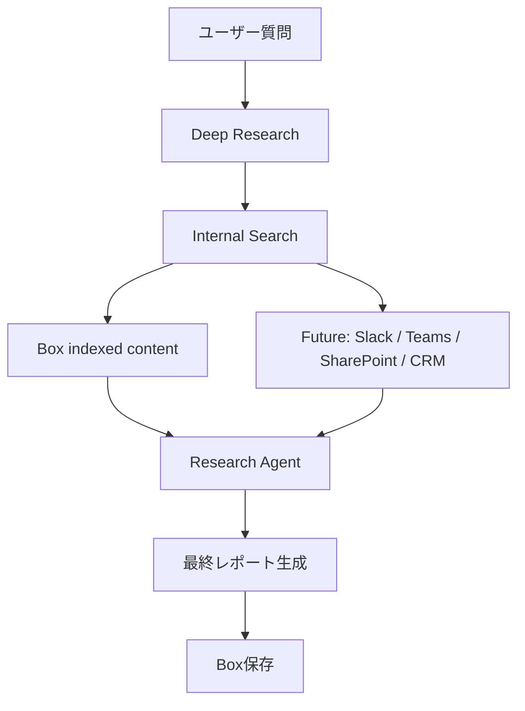
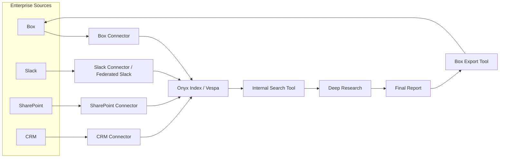

# Deep Research Integration Design

調査日: 2026-06-15  
目的: Onyx Deep Researchを使い、Boxを企業コンテンツ層として調査・レポート生成する。

## 実現したい流れ

## Onyx標準機能でできる部分

### Deep Research orchestration

OnyxにはDeep Researchのループが存在する。

- clarification
- research plan
- research agentの並列実行
- internal search / web search / open URL
- final report generation
- citation mapping

対象コード:

- `backend/onyx/deep_research/dr_loop.py`
- `backend/onyx/tools/fake_tools/research_agent.py`
- `backend/onyx/prompts/deep_research/`

### Internal Search

Deep Researchは `SearchTool` を使ってOnyx内のindexed documentsを検索できる。

標準機能:

- query expansion
- semantic / keyword hybrid search
- RRFによる統合
- LLMによる関連文書選択
- 周辺chunk展開
- ACL filter
- document set filter
- citation mapping

対象コード:

- `backend/onyx/tools/tool_implementations/search/search_tool.py`
- `backend/onyx/context/search/pipeline.py`
- `backend/onyx/context/search/preprocessing/access_filters.py`

### Box検索

Box Connectorを追加して文書をVespaへindexすれば、Internal Searchの対象になる。

追加開発なしで利用できる範囲:

- Box文書の検索
- Box文書を根拠にした回答
- citation表示
- ACL同期済みならユーザーごとの検索制御
- document setでBox subsetを指定

## 追加開発が必要な部分

### Box Connector

必須。

- `DocumentSource.BOX`
- Connector class
- frontend connector設定
- credential form
- file traversal/download
- metadata mapping
- checkpoint

### Box権限同期

企業利用ではほぼ必須。

- file/folder collaboration取得
- group membership取得
- folder権限継承
- shared link policy
- EE sync config登録

### Box保存

Onyx Deep Researchの標準ループは最終レポートをチャット上で生成する。  
Boxへ保存するには追加のegress機能が必要。

候補:

- Tool
- Workflow
- 独立サービス
- Connector拡張

詳細は `docs/box-export-design.md`。

### 将来の横断検索

Onyx標準:

- indexed connectorsはInternal Searchで横断検索可能。
- Slackはfederated searchの実装も存在。
- document setで検索範囲を制御可能。

追加が必要:

- Teams/CRMのConnectorまたはfederated connector。
- どのsourceをDeep Researchに使うかのUI/ポリシー。
- source別citation整形。
- レポート保存先の選択。

## 推奨アーキテクチャ

## 標準機能と追加開発の整理

| 領域 | Onyx標準 | 追加開発 |
|---|---|---|
| Deep Research実行 | あり | なし |
| Box文書検索 | Connectorがあれば可 | Box Connector |
| Box ACL反映 | 仕組みあり | Box権限同期実装 |
| Slack検索 | indexed/federated実装あり | 要設定 |
| Teams検索 | Connectorあり | 要件次第で強化 |
| SharePoint検索 | Connectorあり | 要設定 |
| CRM検索 | Salesforce等あり | 対象CRM次第 |
| レポート生成 | あり | 保存形式整備 |
| Box保存 | なし | Box Export Tool推奨 |
| 調査結果の監査ログ | 一部あり | Box file metadataへの記録など |

## Deep Researchにおける検索範囲設計

推奨:

- 既定は「ユーザーがアクセスできる全社source」
- プロジェクト/顧客単位ではDocument Setを使う
- Box folder単位でDocument Setを自動生成できると運用しやすい

検索範囲例:

- `Box: /Sales/RFP`
- `SharePoint: Product Docs`
- `Slack: #customer-x`
- `CRM: Account = X`

## レポート生成形式

短期:

- Markdown
- citations付き
- Boxに `.md` または `.docx` として保存

中期:

- 顧客向けテンプレート
- executive summary
- findings
- evidence
- open questions
- source appendix

長期:

- Box Doc Gen連携
- Box metadataへ調査条件・source・作成者・作成日時を保存

## 権限の考え方

重要原則:

- 検索時はOnyx ACLで絞る。
- レポート保存時は保存先Box folderの権限に従う。
- レポート本文には、ユーザーがアクセスできた文書だけを引用する。
- 共有先が元文書へアクセスできない可能性は、レポート側の注意表示または保存先ポリシーで制御する。

推奨ポリシー:

- Box保存先はユーザー指定folderまたは管理者指定folder。
- 保存前に「参照元文書の権限」と「保存先folder権限」の差分を検知する。
- 初期版では警告のみ。
- 本番版では保存ブロックまたはredaction。

## 実装順序

1. Box Connector MVP
2. Box文書がInternal Searchで検索できることを確認
3. Deep ResearchでBox文書を引用できることを確認
4. Box Export Toolを追加
5. Box権限同期
6. Events APIによる増分同期
7. 横断source policy / UI

## 未解決論点

- Box enterprise全体をどの認証主体で読むか。
- Box shared linkをOnyx上でpublic扱いにするか。
- コメントを本文に含めるか別Document化するか。
- レポート保存先の権限差分をどこまで強制するか。
- Deep Researchの出力をMarkdown / DOCX / PDFのどれにするか。

## 参照

- `backend/onyx/deep_research/dr_loop.py`
- `backend/onyx/tools/fake_tools/research_agent.py`
- `backend/onyx/tools/tool_implementations/search/search_tool.py`
- `backend/onyx/context/search/preprocessing/access_filters.py`
- Onyx connector overview: https://docs.onyx.app/admins/connectors/overview

